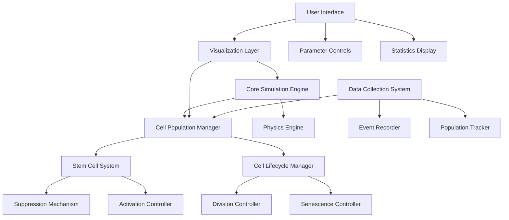
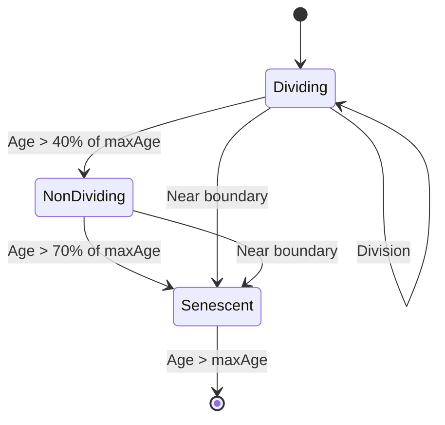
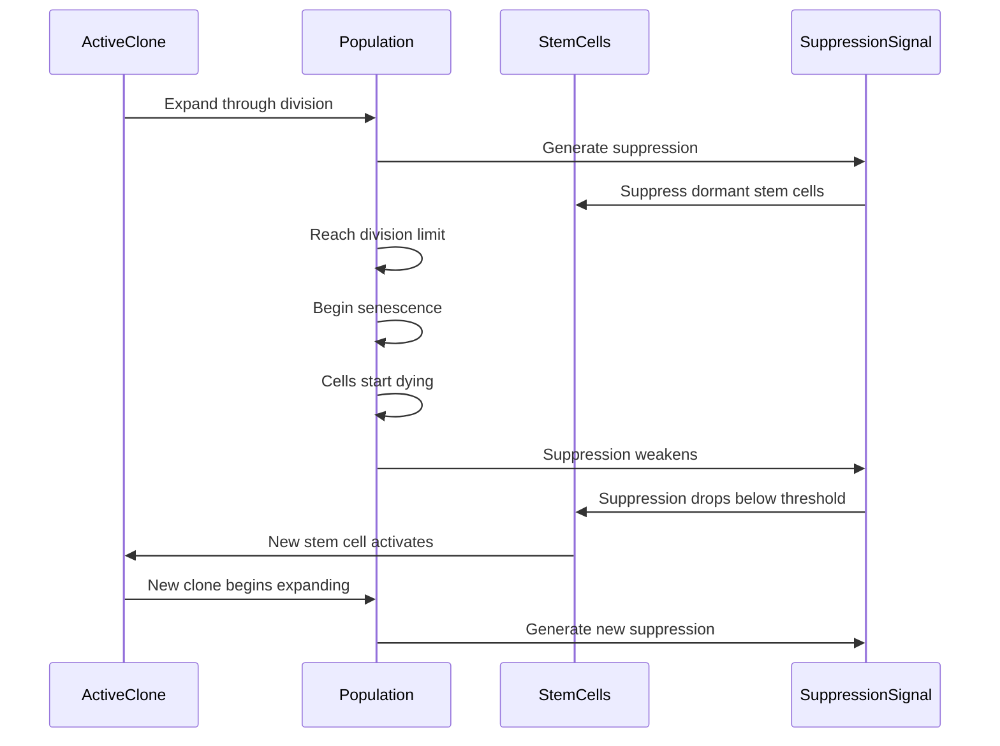

# Design Document: Cell Succession Feature

## Overview

The Cell Succession feature enhances the clonal succession simulation by implementing a more biologically accurate model of stem cell activation, division, and population dynamics. This design document outlines the architecture, components, data models, and implementation strategies for this feature, including the cleanup of the animations folder and the addition of web-bas

The design focuses on creating a realistic visualization of how tumor cell populations maintain themselves through cycles of stem cell activation and clonal expansion, with particular emphasis on the succession process where new stem cells activate as older populations decline.

## Architecture

### High-Level Architecture

The Cell Succession feature wnts:

1. **Simulation Core**: Handles the physics, cell cs
2. **Visualization Layer**: Renders cells, stem cells, and visual indirs

4. **Data Collection System**:
5. **File Organization System**: Manages the cleanup and organization of files

```mermaid

    A[Simulation Core] e]
    A --> C[Cell Lifecycle Manager]
    A --> D[Population Controller]
    A --> E[Stem Cell Manager]

    F[Visualization Layer]]
    F --> H[Suppression Visualizer]
    F --> I[Statistics Display]
    
rols]
    J --> L[Simulatio
    
    M[Data Collection System] --> N[Popu]
    M --> O[Event Logger]
xport]
    
    A <--> F
    A <--> J
    A <--> M
``


cells
- **Control I**
- **Data Cole**
- All components are designed to be modun

## Components and Interfaces

### 1. Simulation Core

#### Cell Lifecycle Manager

Responsible for managing the lifecycle of individual cells, including.

**Interface:**
```
r {
  constructo. }
  updateCellState(cell) { ... }
  handleCellDivision(cell) { ... }
  handleCellDeath(cell) { ... }
  g. }
. }
}
```

#### Stem Cell Manager

rocess.

**Interface:**
```

  constructor}
  updateSuppressionSignal(activeCe.. }
  checkActivationConditions() { ... }
  a.. }
 
  g. }
}
  setActivationThreshold(value) { ... }

```

#### Population Controller

Maintains population homeos

**Interface:**
```javascript
cla
... }
  updatePopula. }
  adjustDivisionRates(current}
  adjustDeathRates(currentP
  setTargetPopulation(value) { ... }
  s ... }
}
```

### 2. Visualization Layer

derer

Renders cells with appropriate colors and visual effects bclone.

*e:**
```
rer {
  constructor(ctx, colorSch ... }
.. }
  renderStemC
  renderDivisionEvent(cell, new... }
  renderDeathEvent(cell) { ... }
  setColorScheme(scheme) { ... }
}
```

#### Suppression Visualizer

Visualizes the suppression field and its effects on dormant stem cells.

*
```javascript
class SuppressionVisualizer {
  constructor(ctx) { ... }
  renderSuppressionField { ... }
  r.. }
 }
}
```

#### Statistics Display

.

**Interface:**
```javascript
class StatisticsDisplay {
  c}
... }
  updateCloneStatisti... }
  updateTimeDisplay(timeData) . }
  updateSuppressionLe { ... }
}
```

### 3. Control Interface

###

Provides controls fos.

**I**
`cript
cla {
}
  createControl(paramete.. }
.. }
  setParametee) { ... }
  validateParameterValue(par }
}
```

#### Simulation Controls

ulation.

**Interface:**
```javascript
class SimulationControls {
  constructor(simulationCallbacks) { ... }
  handlePlayPause() { ... }
  handleReset() { ... }
  h
}
}
```

###

#### Population Tracker

Tra

**Interface:**
```javascript
claker {
 
  t) { ... }
}
  getCloneStatistics() {}
 }
}
```

#### Event Logger

Logs significant events during the simulation.

**Iface:**
t
class EventL {
  constructor() { ... }
  logEvent(eventType, details) { ... }
  getEventHistory() { ... }
  c() { ... }
) { ... }
}
```

s

### Cell Model

ript
class Cell {
  constructor(x, y, clone, population) {
   
  };
   ow'

    this.age = 0;
on
    this.stat
    this.divisionsLefone
    this.isStemCell = false;           // Regular cell blt
    this.isActive = false;             // For s
    this.suppressionStrength = 0;      // For active em cells
    this.body = null;                  // Physics body refere
  }
  
  // Methods
  update() { ... }
  divide() { ... }
  transitionState(newState }
  g

}
```

### Stem Cell Model


class StemCell extends Cell {
  constructor(x, y, clone, population) {
   );
 l = true;
   ;

    this.activld
s
  }
  
  // Additions
 
  suppress(strength) { ... }
  produceSuppressionSignal() { ... }
  canActivate(currentSuppressionLevel) { ... }
}
```

### Simulation State Model

```javascript
clasate {
  constructor() {
    this.cells = [];
  {
   ll,
l,
      yellow: null
;
    this.acti'red';
 
    this.clonePopulations = {
      red: 0,
      green: 0,
      yellow: 0
    };
    this.time = {
      days: 1,
      ,
      minute0,
      totalFrames: 0
    };
    this.parameters = {
      
      activat,
      maxCells: 100,
      divisionLimit: 25
    };
    t;
  }
  
  // Methods
  saveState() { ..}
  loadState() { ... }
  re
}
```

## Error Handling

### Error Types

1. **Physics Errors**: Errors related to the physic)
2. **Parameter Errors**: Errors related to invalid parameter vales
3g
4. d export

### Error Handling Sy

- **Graceful ity
-cur
- **Logging**: Log errors for debugging purposes
- **Recovery**: Attempt to recover from error error)

### Error Preventi

- **n
- **Boundary Checking**: Ensure cells stay within the 
- **Performance Monitoring**: Monitor performance ands

## Testing Strategy

### Unit Testing

-
- Ftion


ting

- Test interactions between components
- Ensure the simulation core correctly updates the visualization lay
- Verify that control inputs properly affect the simulation

### End-to-End Testing

- Test the complete simulation flow
- Verify that the simulation behaves correctly uns
s

### Performance Testing

- Test with maximum cell count to ensure pceptable
nt leaks
- Test on various devices ity

## Animation Folder Cleanup Strategy

nt


2. Identify core
3. Identify redundant or experimental animations that can be removed
4. Check for references to animation files in oth codebase

ess

1. Create a backup of the current animations folder
2. Remove redundant or experimental animations
3. Organize remaining animations into logical categories
codebase
5. Document the cleanup

### Essential Animations to Keep

ential:

1. **clonal-succession-cycle.html**: The main simuon process
2. **mobile-responsive.css**: CSS for mobile respoeness
3. **mobile-responsive.js**: JavaSs


Animations that appear to be experimentt:

1. **bulletproof-tight-simulation.htmlriant
2. **clean-division.html**: Experimental variant
3. **clean-physics-simulation.html**: Experimental varian
riant
5. **contained-simulation.html**: Experant
6. **current-simulation.html**: Likely superseded 
7. **expanding-cage-simulation.html**: Experimental variant
8. **fluid-simulation.html**: Experimental vt
t
10. **gradual-expansion-sint
11. **improved-simulation.
12. **max-cells-control-simulation.html**: Experimeiant
13. **natural-movement-simulation.html**: Experimental variant
14. **physics-simulation.html**: Experimental vari
15. **popping-clinging.html**: Experimental vart
riant
17. **red-white-cycle.html
18. **responsive-expansion-simulation.html**: Experiment
19. **tight-packed-simulation.html**: Experimental vt
20. **tight-start-simulation.html**: Experime
iant
22. **unlimited-division-simuant

## Web-Based Contribution Setup

on

1. **Repository Setup**: Ensure the repositorybutions
2. **GitHub Pages**: Set up GitHub Pages to preview sitory
3. **Issue Templates**: Create issue templates for bugents

### VS Code on the Webtup

1. **Development Container**: Configeb
2. **Extensions**: Recommend essential extensionslopment
3. **Tasks**: Set up tasks for common development actions

ion

1. **Setup Guide**: Create a comprehensive
2. **Screenshots**: Include screenshots of the ss
3. **Troubleshooting**: Provide solutions for common issues

### Contribution Workflow

1. **Fork Repository**: Instructions for forking t.com
2. **Open in VS Code on the Web**: Instructio web
ebase
4. **Test Changes**: Instructions for testing c
5. **Submit Pull Request**: Guidelines for submittiest

## Implementation Plan

The implementation of the Cell Succphases:

1. **Phase 1: Core Simulation Enhancement**
   - Implement the Cell Lifecycle Manager
er
   - Implemr

2. **Phase 2: Visualization Impro*

   - Imple
   - Updplay

3. **Phase 3: Control Interce**
   - Implement the Parameter rols
   - Update the Simulation Controls

4. **Phase 4: Data Collection**
   - Implement the Population Tracker
   - Implement the Event Logger
   - Add data export functionality

5. **Phase 5: Animation Fol
   - Assess animation files
   - Remove redundant animation
   - Organize remaining animations

6. **Phase 6: Web-Based Contrib Setup**
   ibutions
 web
   - Set up GitHub Pages for preview

## Conclusn

This design documentp.

The modular architecture allows for incremental im

By implementing this design, the cl.expansionlonal ation and c cell activs of stemle cycughthroves in themselmaintapopulations cell umor w tion of hoisualizatl v insightfu andcurate a more acvidel proation wilimulsuccession sonal enance. and maintrationllaboe cocilitat fanentstween compo beerfacese clear intTh. egrationre intly befoindependentd d and teste be developecanponent  comhat each ensuring tsting,nd teation amentpletion setud contribub-basend weleanup a folder cr animationements fog the requiro addressinile alsuccession whal sand clon activation ellm cdel of steate moaccury lliologica bng aeatis on crgn focusee desieature. Thccession fll Sur the Cetrategy foon smplementati i, and models dataponents,ecture, comhe archites t outlinio Code on theVSor entation fCreate docum -    contrbasedr web-sitory fo repo Configure-tionusr Cleanup**deContfaistatistics De the Satualizersion Vishe Suppresment ttsemenr enhanc Renderee Celllement th   - Impvements*ntrolletion Coopulaent the Pll Manag Cehe Stem tplement   - Imfollowing he to tded invi dill bee wieaturession fqupull reng a ub Pagesing GitHges ushan to the codanges chfor makinges elinuid**: Ganges Ch**Make3. ode on the C VS in repositorye forked thningor opens fubory on GitHhe repositoceprsetup  on the webing VS Codeusironment t envmen developg up thetinuide for set gtat## Documen#ed dever web-bas fo w Code on theer for VS containelopmenture a dev Send enhancemts, ature requesfea,  reportshe repotly from tlation direcmu sithed contrieb-baseed for ws configur iaticom IntegritHub.## G#ntal vari: Experimel**lation.htmental varExperimn.html**: latioght-simutra-tiul. **21l variantntarianatal varian variantentalxperim: E**l vaerimental**: Exphtmvision.realistic-di16. **ianant vartaln.htmlession-cycleclonal-succded by superse Likely **:html variaperimentaln.html**: Exiomulatal varianment*: Experi.html*divisionle-ent **g9.ianartmle.h-cyclessionclonal-succy bental variimental vaiml**: Exper.htmnsion-expaesive-slow4. **cohtental va**: Experimr redundanal ovingemo Consider R toAnimations### elation timmuing si trackforFunctions g.js**: e-trackin4. **timesponsivenes mobile rforcript nsivsuccessiete clonal s the complatedemonstration that lessmations are llowing ani the foation,plement current imements anduir project reqBased on the animationsspecific keeping ale for the rationocess and prs in the nimationved aes to remonc refere. Update any4rocnup P### Clearts of theer pactthe projel to are essentiahat s tonimati analitynction and fuoserp pused on theirion files ba animatategorize1. Ce Assessme# Fil## compatibil ensuretond browsers a prevee tomemory usag- Monitor acnce remains erformauearameter valke extreme p lit edge cases Tes-rious scenaer varioderion TesIntegrat### pendenciesulate dets to sim mock objecse- Ucell activand stem nsitions, ate travision, sta cell dithms likelgoris on core acuotion isolaomponents in cividualt ind Tesdegradermance  perfolexity ife comp reducdarieslation bounsimue simulatioto ththem lying s before appuser inputidate all **: Valonut ValidatiInponunters anit encof ics engine iset phys, ree (e.g.en possibls wh errors ocuser whento the es ror messaglear eride c*: Provack*User Feedb** onaled functi reduce with continuhouldlation smus, the siilomponent fa con-criticalf a n: Igradation**Deavascript
{
  type: String,              // Event type (e.g., 'succession', 'population_decline')
  time: {                    // Time of event
    days: Number,
    hours: Number,
    minutes: Number
  },
  details: {                 // Event-specific details
    oldClone: String,        // For succession events
    newClone: String,        // For succession events
    populationBefore: Number,// Population before event
    populationAfter: Number, // Population after event
    trigger: String          // What triggered the event
  }
}
```

## Error Handling

### Physics Engine Errors
- Implement boundary checks to prevent cells from escaping the simulation area
- Add position correction for cells that end up in invalid positions
- Implement velocity damping to prevent excessive movement

### Simulation Logic Errors
- Add validation for cell state transitions
- Implement guards against invalid division attempts
- Add error recovery for unexpected cell behavior

### User Input Validation
- Validate parameter ranges to prevent invalid values
- Implement graceful handling of extreme parameter values
- Provide feedback for invalid user inputs

### Performance Monitoring
- Track frame rate and adjust simulation complexity if needed
- Implement cell count limits to prevent performance degradation
- Add detection for simulation instability

## Testing Strategy

### Unit Testing
- Test individual cell behavior (division, aging, state transitions)
- Test stem cell activation and suppression logic
- Test population dynamics calculations

### Integration Testing
- Test interaction between cells and physics engine
- Test clonal succession process end-to-end
- Test data collection and visualization components together

### Performance Testing
- Test with maximum cell count to ensure smooth performance
- Test long-running simulations for stability
- Test on various devices and screen sizes

### User Interface Testing
- Test responsive design on different screen sizes
- Test all user controls and parameter adjustments
- Test data visualization accuracy

## Animation Folder Cleanup Strategy

### File Assessment
1. Categorize existing animation files:
   - Core simulation files (essential)
   - Support files (CSS, JS utilities)
   - Experimental/development files (candidates for removal)
   - Duplicate or outdated files (candidates for removal)

2. Identify dependencies between files:
   - Which HTML files depend on which JS/CSS files
   - Which files are referenced from outside the animations folder
   - Which files are imported by other files

### Cleanup Implementation
1. Retain essential files:
   - clonal-succession-cycle.html (main simulation)
   - mobile-responsive.css and mobile-responsive.js (responsive design)
   - time-tracking.js (simulation time management)
   - MOBILE_RESPONSIVE_GUIDE.md (documentation)

2. Remove redundant files:
   - Experimental simulations that have been superseded
   - Duplicate implementations with minor variations
   - Outdated versions of current simulations

3. Consolidate similar files:
   - Merge similar functionality into single files
   - Extract common code into shared utilities
   - Standardize naming conventions

4. Update references:
   - Ensure no broken links in remaining files
   - Update any external references to removed files
   - Document changes in README or other documentation

## Implementation Plan

### Phase 1: Refactoring and Cleanup
1. Refactor existing code into modular components
2. Clean up animations folder according to the strategy
3. Implement core data models and interfaces

### Phase 2: Stem Cell System Enhancement
1. Implement StemCell class extending Cell
2. Add suppression mechanism between stem cells
3. Implement visual indicators for stem cells and suppression

### Phase 3: Clonal Succession Logic
1. Implement ClonalSuccessionManager
2. Add population tracking and succession triggers
3. Enhance visualization of succession events

### Phase 4: User Interface and Data Collection
1. Implement configurable parameters for succession
2. Add data collection and visualization components
3. Implement export functionality for collected data

### Phase 5: Testing and Refinement
1. Perform comprehensive testing of all components
2. Optimize performance for large cell counts
3. Refine visual elements and user experience

## Diagrams

### Component Interaction Diagram



### Cell State Transition Diagram



### Clonal Succession Process Diagram



## Conclusion

The Cell Succession feature will enhance the existing clonal succession simulation by implementing a more biologically accurate model with improved visualization and user interaction. The modular architecture allows for easy extension and maintenance, while the cleanup of the animations folder will improve the overall project organization.

The implementation will focus on creating a realistic representation of stem cell activation, suppression, and population dynamics, providing researchers with a valuable tool for understanding tumor maintenance through clonal succession.
## Git
 Commit Practices

To ensure consistent and informative version control, the following Git commit practices will be implemented:

### Commit Frequency

1. **Atomic Commits**: Make small, focused commits that address a single concern
2. **Logical Boundaries**: Commit after completing each logical task or component
3. **Working State**: Ensure the codebase is in a working state after each commit

### Gitmoji Convention

All commit messages will follow the Gitmoji convention to provide visual indication of commit purpose:

```
<gitmoji> <type>: <description>
```

#### Gitmoji Reference Table

| Emoji | Code | Description | Example |
|-------|------|-------------|---------|
| ✨ | `:sparkles:` | Introducing new features | `✨ feat: add stem cell visualization` |
| 🐛 | `:bug:` | Fixing a bug | `🐛 fix: correct cell division logic` |
| 📝 | `:memo:` | Adding or updating documentation | `📝 docs: update README with new features` |
| ♻️ | `:recycle:` | Refactoring code | `♻️ refactor: simplify cell lifecycle management` |
| 🎨 | `:art:` | Improving structure/format of the code | `🎨 style: format simulation code` |
| ⚡️ | `:zap:` | Improving performance | `⚡️ perf: optimize cell rendering` |
| 🔥 | `:fire:` | Removing code or files | `🔥 chore: remove unused animation files` |
| 🧪 | `:test_tube:` | Adding tests | `🧪 test: add tests for stem cell activation` |
| 🚚 | `:truck:` | Moving or renaming files | `🚚 chore: reorganize animation folder` |

### Commit Message Structure

1. **Subject Line**: Brief description (50 chars or less) with gitmoji and type
2. **Body** (optional): Detailed explanation of changes when needed
3. **Footer** (optional): Reference issues or breaking changes

Example:
```
✨ feat: implement stem cell activation mechanism

Add logic to detect when suppression drops below threshold and activate
a new stem cell. Includes visual indicator for activation events.

Closes #42
```

### Branch Management

1. **Feature Branches**: Create a branch for each feature or fix
2. **Branch Naming**: Use descriptive names with prefixes (e.g., `feature/stem-cell-activation`)
3. **Regular Updates**: Keep branches up-to-date with the main branch
4. **Clean History**: Use interactive rebase to clean up commit history before merging