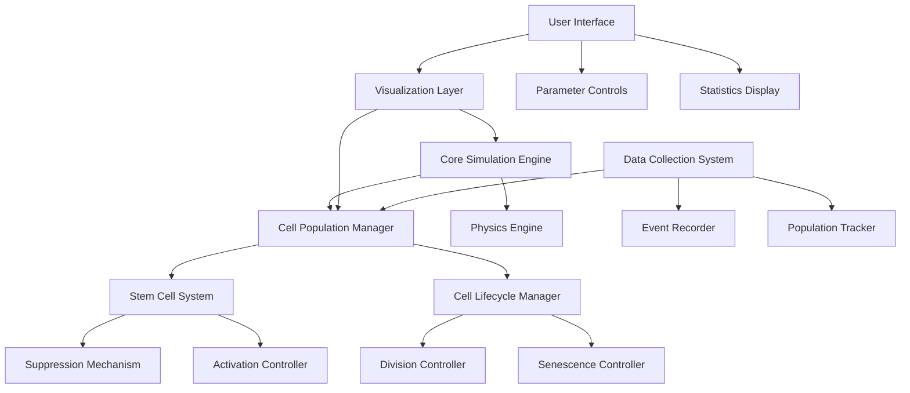
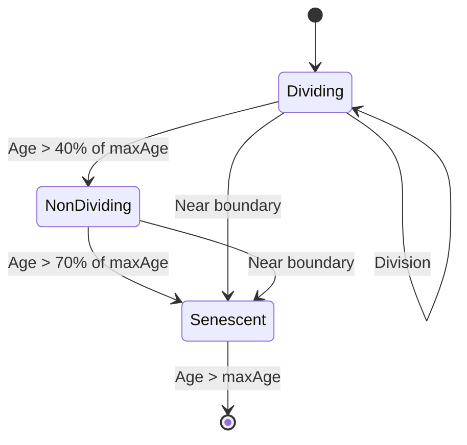
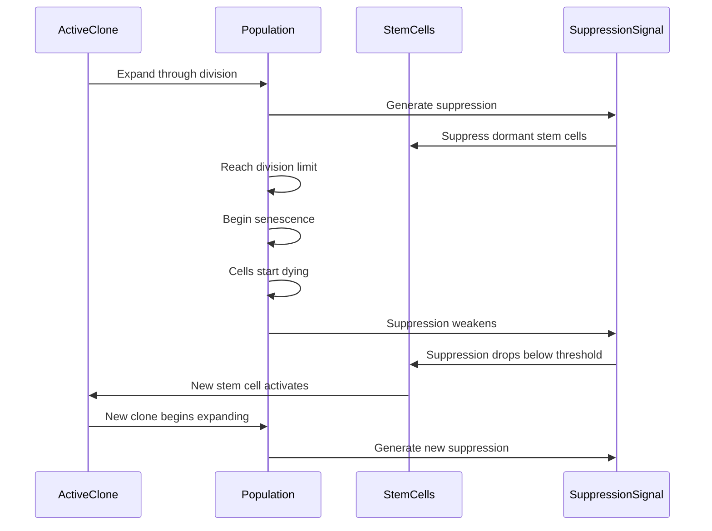

# Design Document: Cell Succession Feature

## Overview

The Cell Succession feature aims to enhance the existing clonal succession simulation by implementing a more biologically accurate model of stem cell activation, division, and population dynamics. This design document outlines the architecture, components, and implementation details for this feature, including the cleanup of the animations folder to improve maintainability.

The feature will focus on visualizing the process by which tumor cell populations maintain themselves through cycles of stem cell activation and clonal expansion, with particular emphasis on the succession mechanism where new stem cells activate as older populations decline.

## Architecture

The Cell Succession feature will be implemented using a modular architecture that separates concerns and allows for easy extension and maintenance. The architecture consists of the following main components:

### 1. Core Simulation Engine
- Handles the physics-based cell movement and interactions
- Manages the simulation loop and time progression
- Provides an API for other components to interact with the simulation

### 2. Cell Population Manager
- Manages the lifecycle of cells (creation, division, senescence, death)
- Implements the clonal succession logic
- Tracks population statistics for each clone

### 3. Stem Cell System
- Manages stem cell states (dormant, active, suppressed)
- Implements the suppression mechanism between stem cells
- Controls the activation of new stem cells based on population dynamics

### 4. Visualization Layer
- Renders cells and their states on the canvas
- Provides visual feedback for succession events
- Implements visual indicators for suppression fields

### 5. User Interface
- Provides controls for simulation parameters
- Displays real-time statistics and data
- Allows for interaction with the simulation

### 6. Data Collection System
- Tracks and records population dynamics over time
- Captures key events in the succession process
- Provides data for analysis and export

## Components and Interfaces

### Cell Class

```javascript
class Cell {
  constructor(x, y, clone, population) {
    this.clone = clone;                // 'red', 'green', or 'yellow'
    this.population = population;      // Population number
    this.age = 0;                      // Current age in frames
    this.maxAge = 1000 + Math.random() * 500; // Maximum lifespan
    this.state = 'dividing';           // 'dividing', 'non-dividing', or 'senescent'
    this.canDivide = true;             // Whether the cell can divide
    this.divisionCooldown = 0;         // Frames until next division is possible
    this.isStemCell = false;           // Whether this is a stem cell
    this.body = null;                  // Physics body for Matter.js
    this.id = generateUniqueId();      // Unique identifier
  }

  update() {
    // Update cell state based on age and conditions
    // Handle movement and interactions
    // Check for state transitions
  }

  divide() {
    // Create a new cell
    // Handle division cooldown
    // Update stem cell division count if applicable
  }

  getColor() {
    // Return color based on clone and state
  }

  destroy() {
    // Remove cell from simulation
    // Trigger appropriate signals
  }
}
```

### StemCell Class (extends Cell)

```javascript
class StemCell extends Cell {
  constructor(x, y, clone, population) {
    super(x, y, clone, population);
    this.isStemCell = true;
    this.divisionsLeft = 25;           // Number of divisions remaining
    this.active = false;               // Whether stem cell is active
    this.suppressionStrength = 0;      // Current suppression strength
  }

  activate() {
    // Activate the stem cell
    // Reset divisions left
    // Update visual appearance
  }

  updateSuppression() {
    // Calculate suppression strength based on population
    // Apply suppression to other stem cells
  }

  canActivate(totalPopulation, maxPopulation) {
    // Check if stem cell can activate based on conditions
  }
}
```

### ClonalSuccessionManager

```javascript
class ClonalSuccessionManager {
  constructor(world, maxCells) {
    this.world = world;                // Matter.js world
    this.maxCells = maxCells;          // Maximum cell count
    this.cells = [];                   // All cells in simulation
    this.stemCells = {};               // Map of stem cells by clone
    this.activeClone = null;           // Currently active clone
    this.dyingCellCount = 0;           // Count of dying cells
    this.activationThreshold = 10;     // Threshold for new stem cell activation
  }

  initialize() {
    // Create initial stem cells
    // Set up initial active clone
    // Add initial cells
  }

  update() {
    // Update all cells
    // Check for succession events
    // Update statistics
  }

  checkSuccession() {
    // Count senescent cells
    // Check activation threshold
    // Trigger new cycle if conditions met
  }

  triggerNewCycle() {
    // Activate next stem cell
    // Reset counters
    // Add initial cells for new clone
  }

  addCell(x, y, clone, population) {
    // Create and add a new cell to the simulation
  }

  removeCell(cell) {
    // Remove a cell from the simulation
  }
}
```

### VisualizationManager

```javascript
class VisualizationManager {
  constructor(canvas, successionManager) {
    this.canvas = canvas;
    this.ctx = canvas.getContext('2d');
    this.successionManager = successionManager;
  }

  draw() {
    // Clear canvas
    // Draw cage boundary
    // Draw cells with appropriate colors
    // Draw stem cells with special indicators
    // Draw suppression fields
    // Draw connections between dividing cells
  }

  drawSuppressionField(stemCell) {
    // Draw visual representation of suppression field
    // Adjust opacity based on strength
  }

  drawSuccessionEvent(oldClone, newClone) {
    // Create visual effect for succession event
  }

  updateStats() {
    // Update UI elements with current statistics
  }
}
```

### DataCollectionSystem

```javascript
class DataCollectionSystem {
  constructor(successionManager) {
    this.successionManager = successionManager;
    this.populationHistory = {};       // Population counts over time
    this.events = [];                  // Key events in simulation
    this.currentTime = 0;              // Current simulation time
  }

  update() {
    // Record current population counts
    // Track simulation time
    // Detect and record key events
  }

  recordEvent(type, details) {
    // Add event to history with timestamp
  }

  getPopulationData() {
    // Return formatted population data
  }

  exportData() {
    // Export data in JSON format
  }
}
```

### UserInterface

```javascript
class UserInterface {
  constructor(successionManager, visualizationManager) {
    this.successionManager = successionManager;
    this.visualizationManager = visualizationManager;
    this.controls = {};                // UI control elements
  }

  initialize() {
    // Set up event listeners
    // Create UI controls
    // Initialize displays
  }

  updateDisplays() {
    // Update population counts
    // Update clone statistics
    // Update time display
  }

  handleParameterChange(parameter, value) {
    // Update simulation parameters based on user input
  }
}
```

## Data Models

### Cell Data Model

```javascript
{
  id: String,                // Unique identifier
  clone: String,             // 'red', 'green', or 'yellow'
  population: Number,        // Population number
  state: String,             // 'dividing', 'non-dividing', or 'senescent'
  age: Number,               // Current age in frames
  maxAge: Number,            // Maximum lifespan
  position: {                // Current position
    x: Number,
    y: Number
  },
  isStemCell: Boolean,       // Whether this is a stem cell
  divisionsLeft: Number      // For stem cells, divisions remaining
}
```

### Simulation State Model

```javascript
{
  cells: Array<Cell>,        // All cells in simulation
  activeClone: String,       // Currently active clone
  stemCells: {               // Stem cell states
    red: {
      active: Boolean,
      divisionsLeft: Number,
      suppressionStrength: Number
    },
    green: {
      active: Boolean,
      divisionsLeft: Number,
      suppressionStrength: Number
    },
    yellow: {
      active: Boolean,
      divisionsLeft: Number,
      suppressionStrength: Number
    }
  },
  simulationTime: {          // Current simulation time
    days: Number,
    hours: Number,
    minutes: Number
  },
  populationCounts: {        // Current population counts
    total: Number,
    red: Number,
    green: Number,
    yellow: Number,
    senescent: Number
  },
  cageRadius: Number,        // Current cage radius
  targetCageRadius: Number   // Target cage radius for expansion
}
```

### Event Data Model

```javascript
{
  type: String,              // Event type (e.g., 'succession', 'population_decline')
  time: {                    // Time of event
    days: Number,
    hours: Number,
    minutes: Number
  },
  details: {                 // Event-specific details
    oldClone: String,        // For succession events
    newClone: String,        // For succession events
    populationBefore: Number,// Population before event
    populationAfter: Number, // Population after event
    trigger: String          // What triggered the event
  }
}
```

## Error Handling

### Physics Engine Errors
- Implement boundary checks to prevent cells from escaping the simulation area
- Add position correction for cells that end up in invalid positions
- Implement velocity damping to prevent excessive movement

### Simulation Logic Errors
- Add validation for cell state transitions
- Implement guards against invalid division attempts
- Add error recovery for unexpected cell behavior

### User Input Validation
- Validate parameter ranges to prevent invalid values
- Implement graceful handling of extreme parameter values
- Provide feedback for invalid user inputs

### Performance Monitoring
- Track frame rate and adjust simulation complexity if needed
- Implement cell count limits to prevent performance degradation
- Add detection for simulation instability

## Testing Strategy

### Unit Testing
- Test individual cell behavior (division, aging, state transitions)
- Test stem cell activation and suppression logic
- Test population dynamics calculations

### Integration Testing
- Test interaction between cells and physics engine
- Test clonal succession process end-to-end
- Test data collection and visualization components together

### Performance Testing
- Test with maximum cell count to ensure smooth performance
- Test long-running simulations for stability
- Test on various devices and screen sizes

### User Interface Testing
- Test responsive design on different screen sizes
- Test all user controls and parameter adjustments
- Test data visualization accuracy

## Animation Folder Cleanup Strategy

### File Assessment
1. Categorize existing animation files:
   - Core simulation files (essential)
   - Support files (CSS, JS utilities)
   - Experimental/development files (candidates for removal)
   - Duplicate or outdated files (candidates for removal)

2. Identify dependencies between files:
   - Which HTML files depend on which JS/CSS files
   - Which files are referenced from outside the animations folder
   - Which files are imported by other files

### Cleanup Implementation
1. Retain essential files:
   - clonal-succession-cycle.html (main simulation)
   - mobile-responsive.css and mobile-responsive.js (responsive design)
   - time-tracking.js (simulation time management)
   - MOBILE_RESPONSIVE_GUIDE.md (documentation)

2. Remove redundant files:
   - Experimental simulations that have been superseded
   - Duplicate implementations with minor variations
   - Outdated versions of current simulations

3. Consolidate similar files:
   - Merge similar functionality into single files
   - Extract common code into shared utilities
   - Standardize naming conventions

4. Update references:
   - Ensure no broken links in remaining files
   - Update any external references to removed files
   - Document changes in README or other documentation

## Implementation Plan

### Phase 1: Refactoring and Cleanup
1. Refactor existing code into modular components
2. Clean up animations folder according to the strategy
3. Implement core data models and interfaces

### Phase 2: Stem Cell System Enhancement
1. Implement StemCell class extending Cell
2. Add suppression mechanism between stem cells
3. Implement visual indicators for stem cells and suppression

### Phase 3: Clonal Succession Logic
1. Implement ClonalSuccessionManager
2. Add population tracking and succession triggers
3. Enhance visualization of succession events

### Phase 4: User Interface and Data Collection
1. Implement configurable parameters for succession
2. Add data collection and visualization components
3. Implement export functionality for collected data

### Phase 5: Testing and Refinement
1. Perform comprehensive testing of all components
2. Optimize performance for large cell counts
3. Refine visual elements and user experience

## Diagrams

### Component Interaction Diagram



### Cell State Transition Diagram



### Clonal Succession Process Diagram



## Conclusion

The Cell Succession feature will enhance the existing clonal succession simulation by implementing a more biologically accurate model with improved visualization and user interaction. The modular architecture allows for easy extension and maintenance, while the cleanup of the animations folder will improve the overall project organization.

The implementation will focus on creating a realistic representation of stem cell activation, suppression, and population dynamics, providing researchers with a valuable tool for understanding tumor maintenance through clonal succession.